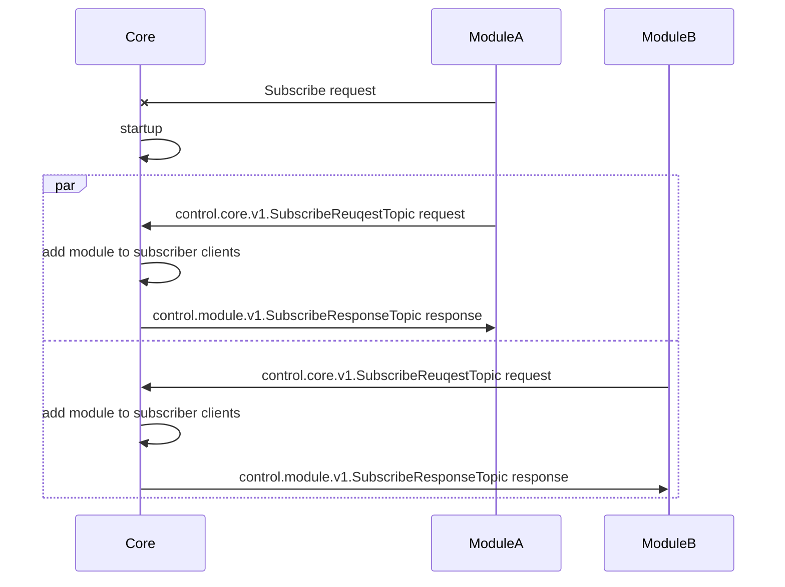

# Subscribe

```mermaid
sequenceDiagram
    participant Core
    participant ModuleA
    participant ModuleB

    ModuleA -x Core : Subscribe request

    Core ->> Core : startup

    par
        ModuleA ->> Core : control.core.v1.SubscribeReuqestTopic request
        Core ->> Core : add module to subscriber clients
        Core ->> ModuleA : control.module.v1.SubscribeResponseTopic response
    and
        ModuleB ->> Core : control.core.v1.SubscribeReuqestTopic request
        Core ->> Core : add module to subscriber clients
        Core ->> ModuleB : control.module.v1.SubscribeResponseTopic response
    end
```
