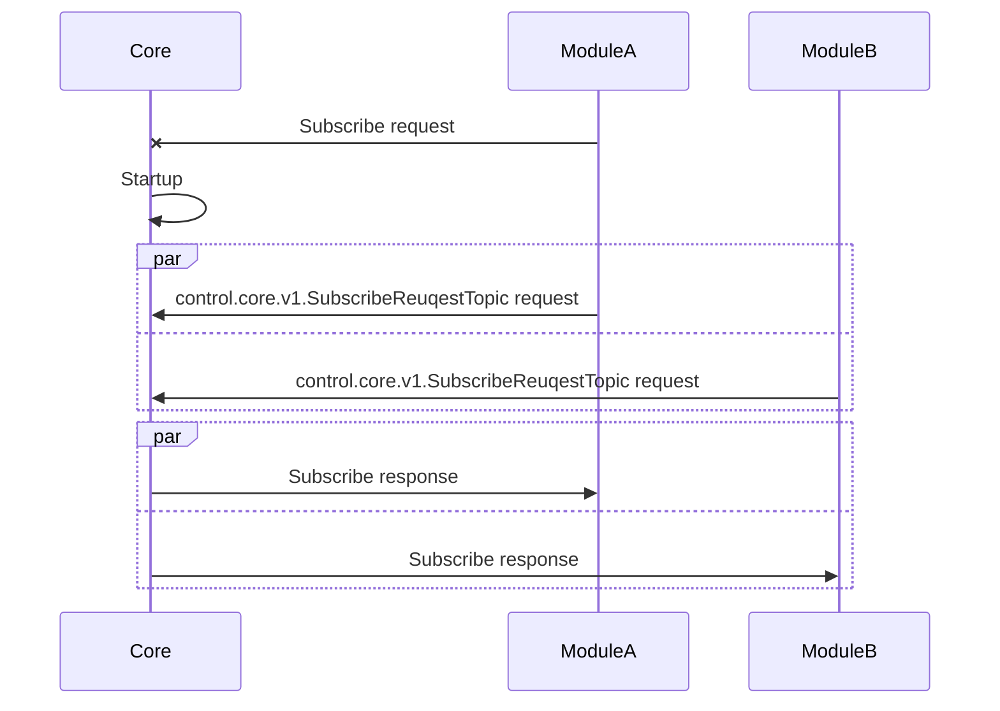

#Subscribe

```mermaid
sequenceDiagram
    participant Core
    participant ModuleA
    participant ModuleB

    ModuleA -x Core : Subscribe request

    Core ->> Core : Startup

    par
        ModuleA ->> Core : control.core.v1.SubscribeReuqestTopic request
    and
        ModuleB ->> Core : control.core.v1.SubscribeReuqestTopic request
    end

    par
        Core ->> ModuleA : Subscribe response
    and
        Core ->> ModuleB : Subscribe response
    end
```
